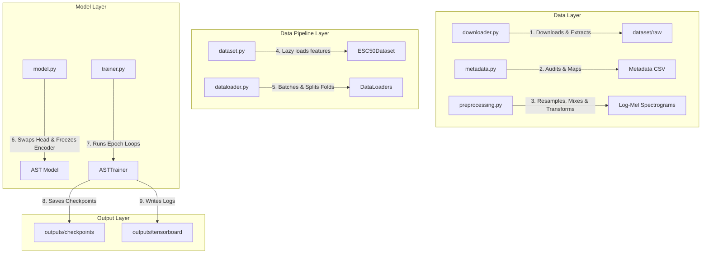
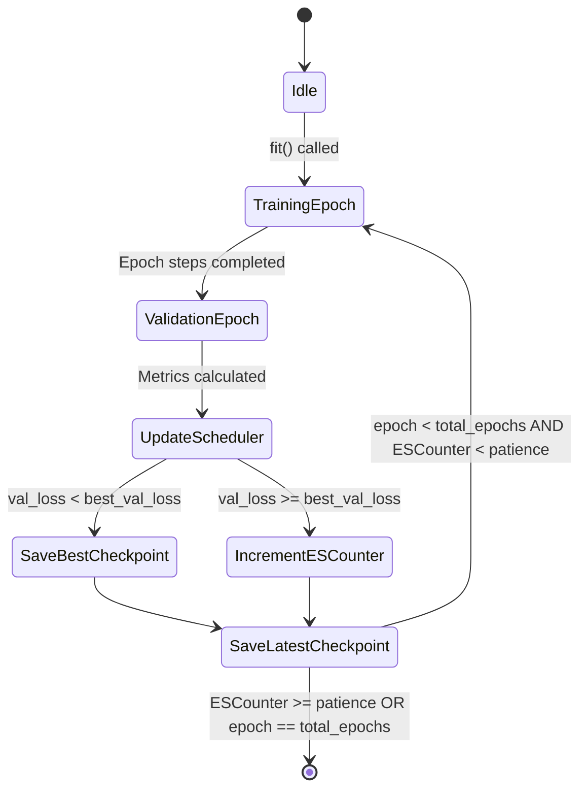

# 🏗️ System Architecture: ESC-50 AST

This document provides a detailed breakdown of the software and machine learning architecture for the Environmental Sound Classification (ESC) pipeline.

---

## 1. High-Level Architecture Overview

The system is designed around a decoupled, modular pipeline where each stage has a single, well-defined responsibility:

---

## 2. Data Processing Pipeline

### Standardizing Raw Waveforms
Raw audio clips in the ESC-50 dataset are 5 seconds long and recorded at a 44.1kHz sampling rate in stereo.
1. **Mono Mixing**: Converted to mono by averaging the channels:
   $$x_{\text{mono}} = \frac{x_{\text{left}} + x_{\text{right}}}{2}$$
2. **Resampling**: Downsampled to 16kHz to match the sample rate the model was pre-trained on.
3. **Padding/Truncation**: Clipped or padded with zeros to exactly 5.0 seconds (80,000 samples).

### Log-Mel Spectrogram Extraction
The 1D standardized waveform ($80,000$ samples) is transformed into a 2D Log-Mel spectrogram:
* **Window size (`n_fft`)**: 400 samples (25ms window) to capture local frequency details.
* **Stride (`hop_length`)**: 160 samples (10ms step) yielding a 90% overlap.
* **Mel Filterbank (`n_mels`)**: 128 Mel bands warping the frequency scale to align with human hearing.
* **Log Amplitude Conversion**: Converts power spectrograms to decibels:
  $$S_{\text{dB}} = 10 \log_{10}(S + \epsilon)$$
  This scales the values to highlight quiet details and make optimization more stable.
* **Normalization**: Standardizes the features using pre-computed AudioSet statistics:
  $$x_{\text{norm}} = \frac{x_{\text{spectrogram}} - \text{mean}}{\text{std}}$$
  Where $\text{mean} = -4.2677393$ and $\text{std} = 4.5689974$.

---

## 3. Audio Spectrogram Transformer (AST) Deep Dive

The AST adapts the standard **Vision Transformer (ViT)** for audio data. Instead of raw audio waveforms, it processes 2D Log-Mel spectrogram images of size $1024 \times 128$:

### 1. Patch Projection
* The input spectrogram ($1024 \times 128$) is split into $16 \times 16$ patches with an overlap of 6 pixels (stride of 10).
* This yields $N = 101 \times 12 = 1212$ patches.
* Each patch is flattened into a 256-dimensional vector and projected to the Transformer's hidden dimension ($D = 768$).

### 2. CLS Token & Position Embeddings
* A trainable **`[CLS]` token** is prepended to the sequence of patch tokens.
* 2D sinusoidal **Positional Embeddings** are added to preserve the time and frequency coordinates of each patch.

### 3. Encoder Backbone
* The sequence of 1,213 tokens (1,212 patches + 1 `[CLS]` token) is routed through 12 Multi-Head Self-Attention layers.
* Each self-attention block allows every patch token to query all other patch tokens globally.

### 4. Classification Head Customization
For ESC-50, we swap the classification head using Hugging Face's `ignore_mismatched_sizes=True` parameter. This replaces the default 527-class head with a new linear projection:
$$\text{Logits} = \mathbf{W} \cdot \mathbf{h}_{\text{CLS}} + \mathbf{b}$$
Where $\mathbf{W} \in \mathbb{R}^{50 \times 768}$, $\mathbf{h}_{\text{CLS}} \in \mathbb{R}^{768}$, and $\mathbf{b} \in \mathbb{R}^{50}$.

---

## 4. Trainer State Machine & Checkpointing

The training loop manages training steps, validation evaluations, early stopping, and checkpointing:

### Checkpoint Structure
Each serialized `.pt` checkpoint file contains:
- `epoch`: Current epoch index.
- `model_state_dict`: Trainable weight tensors.
- `optimizer_state_dict`: Running momentum values.
- `scheduler_state_dict`: Scheduler step variables.
- `best_val_loss`: Running lowest validation loss.
- `history`: Metric lists tracking loss and accuracy history.

---

## 5. Performance Optimizations

1. **Lazy Loading**: `__getitem__` loads and processes WAV files on-demand, preventing RAM exhaustion.
2. **Linear Probing**: Freezing the 86M transformer parameters reduces training overhead to updating only the 39k parameters of the classification head.
3. **Data Pre-fetching**: DataLoaders use multi-process workers to fetch and preprocess batches in the background while the GPU trains.
4. **Pinned Memory**: Uses page-locked memory to accelerate CPU-to-GPU tensor transfers.
