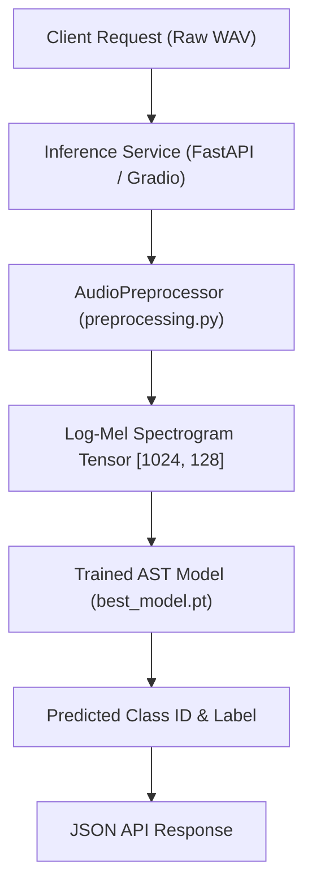

# 🚀 Deployment Guide

This document outlines how to deploy the trained AST model for environmental sound classification into production.

---

## ⚠️ Supabase & Cloudflare R2 Integration Disclaimer

> [!WARNING]
> This repository is configured for local machine learning model training. It does **not** contain deployment configurations, APIs, or hooks for Supabase, Cloudflare R2, Render, or Vercel. All model training runs, CSV logs, TensorBoard events, and model weights (`.pt` checkpoints) are saved directly to the local filesystem.

---

## 1. Inference Deployment Architecture

To deploy the trained AST model into production, you must package the weights generated in [outputs/checkpoints/best_model.pt](file:///Users/legend27648/agy_project/AI%20Audio/ESC_Project/outputs/checkpoints/best_model.pt) along with the source files:



---

## 2. API Service Implementation Template

To serve predictions over HTTP, you can write a lightweight FastAPI wrapper. Below is a production-grade template:

```python
import os
import torch
from fastapi import FastAPI, UploadFile, File, HTTPException
from pydantic import BaseModel
from src.config import PipelineConfig
from src.preprocessing import AudioPreprocessor
from src.model import build_ast_model

app = FastAPI(title="ESC-50 AST Inference Service", version="1.0.0")

# 1. Load configuration and model upon startup
CONFIG_PATH = os.environ.get("ESC_CONFIG_PATH", "configs/config.yaml")
config = PipelineConfig.from_yaml(CONFIG_PATH)

# Initialize preprocessor
preprocessor = AudioPreprocessor(config)

# Initialize model and load weights
device = torch.device("cuda" if torch.cuda.is_available() else "cpu")
model = build_ast_model(config)

CHECKPOINT_PATH = os.environ.get("ESC_CHECKPOINT_PATH", "outputs/checkpoints/best_model.pt")
if not os.path.exists(CHECKPOINT_PATH):
    raise FileNotFoundError(f"Model checkpoint not found at: {CHECKPOINT_PATH}")

checkpoint = torch.load(CHECKPOINT_PATH, map_location=device)
model.load_state_dict(checkpoint["model_state_dict"])
model.to(device)
model.eval()

# Load class names from metadata csv
# The model maps IDs 0-49 to categories. We can load these programmatically
from src.metadata import ESC50Metadata
metadata = ESC50Metadata(config)
metadata.load_and_validate()
id_to_class = metadata.id_to_class

class PredictionResponse(BaseModel):
    class_id: int
    class_name: str
    confidence: float

@app.post("/predict", response_model=PredictionResponse)
async def predict_audio(file: UploadFile = File(...)):
    """Accepts a WAV file, runs the DSP pipeline, and returns the predicted category."""
    if not file.filename.endswith(".wav"):
        raise HTTPException(status_code=400, detail="Only standard WAV files are supported.")

    # Save temporary upload
    temp_wav_path = f"temp_{file.filename}"
    with open(temp_wav_path, "wb") as f:
        f.write(await file.read())

    try:
        # 2. Run Preprocessing
        # Force use_hf=True to match AST input shape
        features = preprocessor.process_file(temp_wav_path, use_hf=config.model.use_hf)
        features = features.unsqueeze(0).to(device)  # Add batch dimension [1, 1024, 128]

        # 3. Model Forward Pass
        with torch.no_grad():
            outputs = model(input_values=features)
            logits = outputs.logits
            probs = torch.softmax(logits, dim=-1)
            
            confidence, class_id = torch.max(probs, dim=-1)
            class_id = int(class_id.item())
            confidence = float(confidence.item())

        return PredictionResponse(
            class_id=class_id,
            class_name=id_to_class.get(class_id, "Unknown"),
            confidence=confidence
        )

    except Exception as e:
        raise HTTPException(status_code=500, detail=f"Inference failed: {str(e)}")
        
    finally:
        # Cleanup temp file
        if os.path.exists(temp_wav_path):
            os.remove(temp_wav_path)
```

---

## 3. Deploying to Cloud VMs (AWS EC2 / GCP Compute Engine)

If you are hosting the API service on a cloud instance, follow these setup steps:

1. **Provision Instance**: Launch a virtual machine with a GPU accelerator (e.g. AWS `g4dn.xlarge` instance containing an NVIDIA T4 GPU). Install CUDA Drivers and Python 3.10+.
2. **Transfer Files**: Clone the repository and transfer the trained `best_model.pt` to the `outputs/checkpoints/` folder on the instance.
3. **Environment Setup**: Set up the environment and install requirements:
   ```bash
   python3 -m venv .venv
   source .venv/bin/activate
   pip install -r requirements.txt
   pip install fastapi uvicorn python-multipart
   ```
4. **Launch Service**: Start the FastAPI server using Uvicorn:
   ```bash
   uvicorn api_server:app --host 0.0.0.0 --port 8000 --workers 2
   ```
