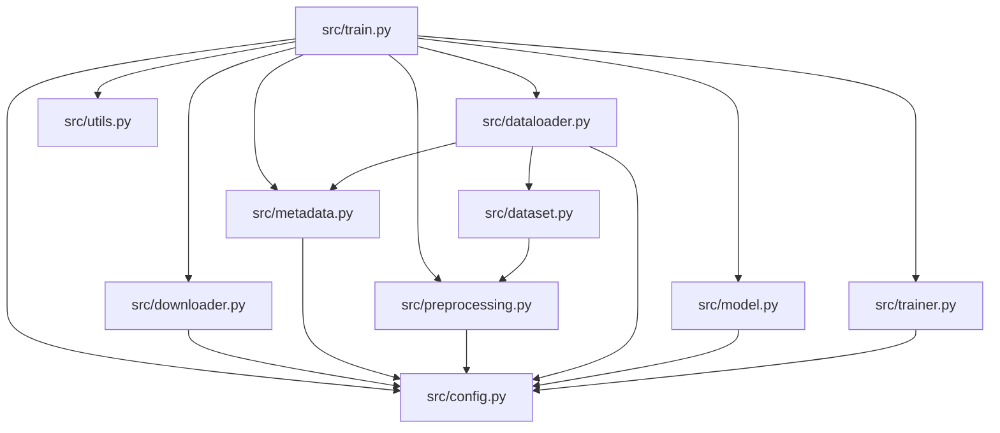

# 📁 Repository Structure Guide

This document provides a detailed breakdown of the directory structure, explaining the purpose of each file and folder in the repository.

---

## 1. Directory Tree Overview

Below is the directory tree of the repository:

```text
ESC_Project/
├── configs/             # Configuration Settings
│   └── config.yaml      # All hyperparameters for preprocessing, model, and trainer
├── dataset/             # Ingested dataset files (created automatically)
│   └── ESC-50-master/   # Extracted dataset folder
│       ├── audio/       # 2,000 raw audio WAV clips
│       └── meta/        # Metadata esc50.csv file
├── docs/                # Product & Student Documentation
│   ├── EXPLANATION.md   # Data prep and DSP training manual (Member 1)
│   └── MEMBER_2.md      # Model, trainer, and MLOps manual (Member 2)
├── logs/                # Local data_pipeline.log output (created automatically)
├── outputs/             # Build Artifacts Folder (created automatically)
│   ├── checkpoints/     # Saved model weights (best_model.pt, latest_model.pt)
│   ├── logs/            # CSV training logs
│   └── tensorboard/     # TensorBoard runs events files
├── src/                 # Source Code Package
│   ├── __init__.py      # Package marker
│   ├── config.py        # Yaml configuration parser mapping to python dataclasses
│   ├── dataloader.py    # Cross-validation folds splitting and PyTorch DataLoaders builder
│   ├── dataset.py       # Custom PyTorch Dataset subclass with lazy-loading
│   ├── downloader.py    # Programmatic ZIP downloader and unzipper
│   ├── metadata.py      # Metadata csv audit, null cleaning, and class mapping
│   ├── model.py         # Loads pre-trained AST and configures linear probing
│   ├── preprocessing.py # Audio loading, mono-mixing, resampling, and Mel transforms
│   ├── trainer.py       # Core training loops, early stopping, and checkpointing
│   ├── train.py         # Command-line training run orchestrator
│   └── utils.py         # Logging setup and block timing utilities
├── tests/               # Automated Unit Test Suite
│   ├── __init__.py      
│   ├── test_model.py    # Tests model loading, optimizer steps, and checkpoints
│   └── test_pipeline.py # Tests DSP preprocessor and dataset batching
├── .gitignore           # Git ignore patterns
├── LICENSE              # MIT License
├── requirements.txt     # Locked production package dependencies
└── README.md            # Master repository documentation
```

---

## 2. Core Modules Breakdown

### Ingestion & Processing
* **`downloader.py`**: Downloads the Karol Piczak ESC-50 ZIP archive from GitHub and extracts it to the `dataset/` directory. It uses a progress bar (`tqdm`) and includes an SSL workaround for macOS.
* **`metadata.py`**: Uses Pandas to parse `meta/esc50.csv`. It runs integrity checks for duplicate filenames, null values, and out-of-bounds fold indices. It builds class mapping dictionaries (`class_to_id` and `id_to_class`).
* **`preprocessing.py`**: Implements the DSP pipeline. It resamples audio using torchaudio or soundfile, mixes channels to mono, crops/pads clips to 5.0 seconds, and extracts log-Mel spectrograms.

### PyTorch Integration
* **`dataset.py`**: Implements `ESC50Dataset` with lazy-loading. Tensors are processed on-demand, preventing RAM exhaustion.
* **`dataloader.py`**: Maps folds to training, validation, and test splits, and initializes optimized `DataLoader` instances with multi-process workers and pinned memory.
* **`config.py`**: Parses the YAML config file into strongly typed Python dataclasses to enforce configuration constraints and type-safety.
* **`utils.py`**: Configures console and file logging to `logs/data_pipeline.log`, and provides execution timing helpers.

### Modeling & Training (MLOps)
* **`model.py`**: Integrates Hugging Face's `ASTForAudioClassification`, adapts the classifier layer for 50-class outputs using size mismatch flags, freezes the encoder backbone for linear probing, and audits parameter counts.
* **`trainer.py`**: Implements `ASTTrainer`. It runs training epochs, validates splits, logs to CSV and TensorBoard, saves checkpoints, and handles early stopping.
* **`train.py`**: Orchestrates the entire training pipeline. It handles device discovery (CUDA/MPS/CPU), initializes the components, and runs training or resumes from a checkpoint.

---

## 3. Module Dependency Graph

Below is the dependency graph showing how modules import and call one another:


