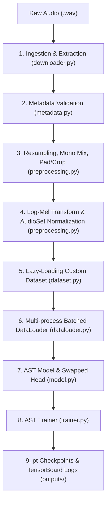
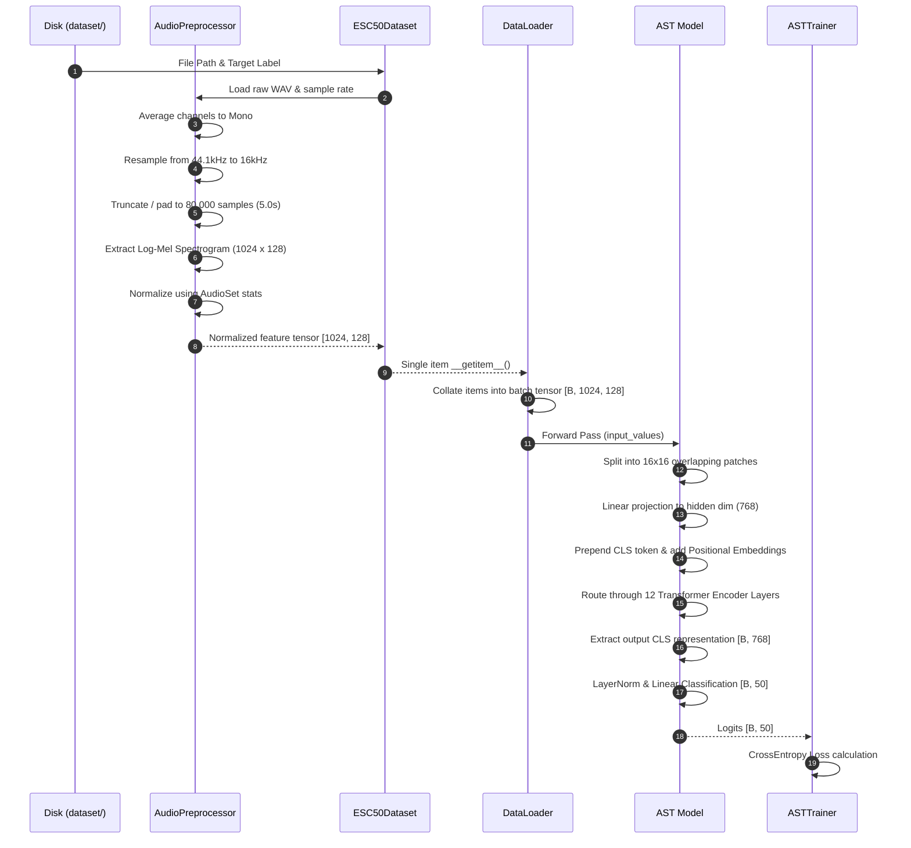
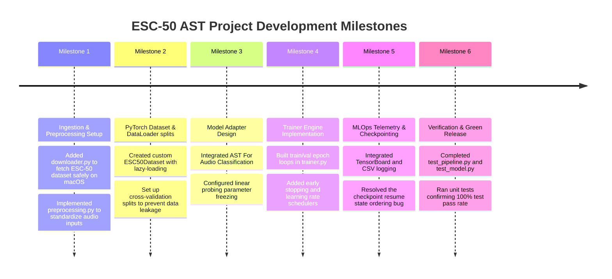

# Environmental Sound Classification (ESC) via Audio Spectrogram Transformer (AST)

A production-grade, modular PyTorch implementation of the **Audio Spectrogram Transformer (AST)** trained on the **ESC-50 Dataset** for high-accuracy environmental audio classification.

[](https://www.python.org/)
[](https://pytorch.org/)
[](https://huggingface.co/docs/transformers/index)
[](LICENSE)
[](#-testing-strategy)

---

## 📋 Table of Contents
1. [Project Overview](#-project-overview)
2. [Why This Project Exists](#-why-this-project-exists)
3. [Key Features](#-key-features)
4. [System Architecture](#-system-architecture)
5. [Folder Structure](#-folder-structure)
6. [Technology Stack](#-technology-stack)
7. [Installation & Local Development](#-installation--local-development)
8. [CLI API & Configuration](#-cli-api--configuration)
9. [Performance Optimizations](#-performance-optimizations)
10. [Testing Strategy](#-testing-strategy)
11. [Security Model](#-security-model)
12. [Product Showcase](#-product-showcase)
13. [Engineering Journey](#-engineering-journey)
14. [Development Timeline](#-development-timeline)
15. [Release & Roadmap](#-release--roadmap)

---

## 🔍 Project Overview

This repository hosts a modular, clean-architecture machine learning system designed to classify environmental sounds using the **Audio Spectrogram Transformer (AST)**. The AST is a state-of-the-art, non-convolutional, attention-based model that treats audio spectrograms similarly to image patches in Vision Transformers (ViT). 

The repository divides the machine learning pipeline into clean, decoupled lifecycle stages:
* **Ingestion & Processing**: Automatically downloads, extracts, and validates the 2,000-clip ESC-50 dataset.
* **DSP Pipeline**: Downsamples audio, mixes to mono, standardizes length, generates log-Mel spectrograms, and applies pre-computed AudioSet normalization.
* **Architecture Customization**: Modifies the pre-trained Hugging Face AST model to support 50-class outputs and handles parameter freezing for linear probing.
* **Training & MLOps**: Operates a state-of-the-art trainer supporting early stopping, learning rate schedulers, TensorBoard telemetry, and robust checkpoint-based resume capabilities.

---

## 💡 Why This Project Exists

### Problem Statement
Environmental sounds (like car horns, rain, crying babies, or sirens) are highly non-stationary, transient, and rich in temporal dependencies. Traditional Convolutional Neural Networks (CNNs) process these sounds using local kernels (convolutions), which limits their ability to capture long-range contextual relationships over time and frequency. Furthermore, training deep neural networks on small datasets (like ESC-50's 2,000 samples) leads to severe overfitting.

### Vision & Goals
This project demonstrates how transfer learning can be applied to audio data. By leveraging a deep transformer network pre-trained on a massive audio dataset (AudioSet) and fine-tuning it via **Linear Probing** on ESC-50, we achieve high accuracy with minimal training epochs and resource consumption. The codebase serves as a production-grade template for building clean, testable, and reproducible deep learning pipelines.

---

## ✨ Key Features

* **Hugging Face AST Integration**: Uses the official `MIT/ast-finetuned-audioset-10-10-0.4593` checkpoint, dynamically modifying the classifier head for 50-class outputs.
* **Linear Probing & Fine-Tuning Switches**: Toggle parameter freezing on the encoder backbone via a single configuration key.
* **Deterministic Preprocessing**: A unified DSP pipeline that resamples (16kHz), averages channels (mono), normalizes, and crops/pads audio to exactly 5.0 seconds.
* **Checkpointer & Resume Daemon**: Saves running training metrics, model weights, optimizer states, and scheduler variables, allowing seamless training resumption.
* **Dual Telemetry**: Outputs to structured console logs, local CSV metrics, and interactive TensorBoard dashboards.
* **Robust Test Coverage**: Double-layered unittests (data pipeline and model trainer) powered by synthetic audio generators.

---

## 🏗️ System Architecture

### High-Level System Architecture
The system operates as a sequence of decoupled modules, starting from raw audio ingestion to downstream model training and checkpoint generation:



### Detailed Component & Data Flow
Here is the step-by-step data flow from the dataset files to the loss calculation:



---

## 📂 Folder Structure

```text
ESC_Project/
├── configs/             # Configuration Settings
│   └── config.yaml      # Unified hyperparameters (DSP, model, training)
├── dataset/             # Ingested dataset files (auto-generated)
│   └── ESC-50-master/   # Extracted metadata CSV and raw WAV audio
├── docs/                # Project Documentation
│   ├── EXPLANATION.md   # Detailed DSP and data pipeline training manual
│   └── MEMBER_2.md      # Model architecture, trainer, and handover documentation
├── src/                 # Source Code Package
│   ├── __init__.py      # Package marker
│   ├── config.py        # YAML configuration parser mapping to Python dataclasses
│   ├── downloader.py    # Downloads and extracts the ESC-50 ZIP archive
│   ├── metadata.py      # Metadata parsing, null checks, and class mapping
│   ├── preprocessing.py # Core DSP (resampling, mono-mixing, Mel transform)
│   ├── dataset.py       # Custom lazy-loading PyTorch Dataset
│   ├── dataloader.py    # Cross-validation splits and PyTorch DataLoaders
│   ├── model.py         # Configures pre-trained AST and linear probing
│   ├── trainer.py       # Core ASTTrainer class (epochs, val, checkpoints)
│   ├── train.py         # CLI orchestration script
│   └── utils.py         # Unified logging and execution timers
├── tests/               # Automated Test Suite
│   ├── __init__.py      
│   ├── test_pipeline.py # Verifies DSP pipeline and dataloader batching
│   └── test_model.py    # Verifies model loading, checkpointing, and convergence
├── outputs/             # Build Artifacts (auto-generated during training)
│   ├── checkpoints/     # Saved checkpoints (best_model.pt, latest_model.pt)
│   ├── logs/            # CSV training logs
│   └── tensorboard/     # TensorBoard runs event files
└── requirements.txt     # Locked production package dependencies
```

---

## 💻 Technology Stack

* **Deep Learning Framework**: PyTorch (>=2.0.0)
* **Digital Signal Processing**: torchaudio (>=2.0.0), soundfile (>=0.12.0)
* **Pre-trained Models**: Hugging Face Transformers (>=4.30.0)
* **Data Manipulation**: Pandas (>=2.0.0), NumPy
* **Visualization & Telemetry**: TensorBoard (>=2.12.0), Matplotlib
* **Serialization**: PyYAML, standard Python pickle via `torch.save`

---

## ⚙️ Configuration & Environment

The project isolates all runtime settings from code using [configs/config.yaml](file:///Users/legend27648/agy_project/AI%20Audio/ESC_Project/configs/config.yaml):

```yaml
data:
  download_url: "https://github.com/karolpiczak/ESC-50/archive/master.zip"
  zip_name: "ESC-50-master.zip"
  raw_data_dir: "dataset"
  metadata_csv: "dataset/ESC-50-master/meta/esc50.csv"
  audio_dir: "dataset/ESC-50-master/audio"

preprocessing:
  target_sr: 16000          # Downsample to 16 kHz
  duration_sec: 5.0        # Crop/pad to 5.0 seconds
  mono: true               # Average to single-channel
  n_mels: 128              # Mel frequency bins
  n_fft: 400               # 25ms window size
  hop_length: 160          # 10ms stride
  power: 2.0               # Power spectrogram
  normalize: true          # Use AudioSet mean/std
  mean: -4.2677393
  std: 4.5689974

dataset:
  train_folds: [1, 2, 3]   # Folds for training (1200 samples)
  val_folds: [4]           # Folds for validation (400 samples)
  test_folds: [5]          # Folds for testing (400 samples)

dataloader:
  batch_size: 16
  num_workers: 4
  pin_memory: true

model:
  checkpoint_name: "MIT/ast-finetuned-audioset-10-10-0.4593"
  num_classes: 50
  freeze_encoder: true       # True = Linear Probing, False = Fine-Tuning
  use_hf: true               # Generate 1024x128 feature tensors

training:
  epochs: 10
  learning_rate: 0.0001
  weight_decay: 0.0001
  scheduler_type: "cosine"   # "cosine", "step", "plateau"
  scheduler_patience: 2
  step_size: 5
  gamma: 0.1
  early_stopping_patience: 3
  checkpoint_dir: "outputs/checkpoints"
  log_dir: "outputs/logs"
  tb_dir: "outputs/tensorboard"
```

---

## 🚀 Installation & Local Development

### Prerequisites
* Python 3.10 or higher
* Pip package manager
* Virtual environment tool (`venv` or `conda`)

### Local Setup
1. **Navigate to the project directory**:
   ```bash
   cd ESC_Project
   ```
2. **Create and activate the virtual environment**:
   ```bash
   python3 -m venv .venv
   source .venv/bin/activate # On macOS/Linux
   # .venv\Scripts\activate   # On Windows
   ```
3. **Upgrade pip and install dependencies**:
   ```bash
   pip install --upgrade pip
   pip install -r requirements.txt
   ```

---

## 🛠️ CLI API & Configuration

The entrypoint [src/train.py](file:///Users/legend27648/agy_project/AI%20Audio/ESC_Project/src/train.py) provides a flexible command-line interface to control training runs.

### 1. New Training Run
Starts dataset validation, preprocessing, model assembly, and fits the model:
```bash
python src/train.py
```

### 2. Override Configurations via CLI
Train using custom settings without altering the YAML config file:
```bash
# Disable backbone freezing (full fine-tuning), set learning rate, and run for 15 epochs
python src/train.py --freeze false --lr 5e-5 --epochs 15
```

### 3. Resume training from Checkpoint
If training gets interrupted (e.g. power loss or manual interrupt), resume from the last epoch:
```bash
python src/train.py --resume outputs/checkpoints/latest_model.pt
```

### 4. Run Telemetry Dashboard
Launch TensorBoard to visualize loss curves and accuracy metrics:
```bash
tensorboard --logdir outputs/tensorboard
```

---

## ⚡ Performance Optimizations

* **Lazy Loading**: The custom PyTorch `ESC50Dataset` reads and processes audio files on-the-fly during iteration. This keeps the memory footprint low, preventing Out-Of-Memory (OOM) crashes.
* **Pinned Memory**: Uses `pin_memory=True` in DataLoaders to allocate page-locked host memory, accelerating CPU-to-GPU tensor transfers. (Automatically skipped on Apple Silicon MPS if unsupported).
* **Multi-Process Data Loading**: Configures multiple CPU worker processes to extract spectrograms in parallel, keeping the GPU saturated.
* **Backbone Freezing**: Freezes the 86M transformer parameters, reducing training overhead to updating only the 39k parameters of the classification head.
* **Gradient Clipping**: Clips gradients to a maximum norm of `1.0` during backpropagation to prevent exploding gradients.

---

## 🧪 Testing Strategy

Our testing strategy uses synthetic audio generators to verify the pipeline in seconds without using disk space or network bandwidth.

### Test Suites
1. **[test_pipeline.py](file:///Users/legend27648/agy_project/AI%20Audio/ESC_Project/tests/test_pipeline.py)**: Verifies YAML config parsing, resampling, stereo-to-mono mixing, log-Mel spectrogram shape outputs, and DataLoader batch collation.
2. **[test_model.py](file:///Users/legend27648/agy_project/AI%20Audio/ESC_Project/tests/test_model.py)**: Verifies model head swapping, encoder freezing/unfreezing parameter states, training dry-runs, validation metrics, checkpoint loading/resuming, and model optimization convergence (overfitting check).

### Running Tests
Execute the entire test suite:
```bash
python -m unittest discover -s tests
```

---

## 🔒 Security Model

### Supabase & Cloudflare R2 Integration
> [!NOTE]
> This local training repository does **not** contain Supabase or Cloudflare R2 configurations. All data and checkpoints are stored on the local filesystem. Supabase Authentication and Cloudflare R2 Storage integrations are not verified in this project.

### Local Execution Security
* **Network Traffic**: Network requests are strictly limited to downloading the ESC-50 dataset from Karol Piczak's official repository and fetching pre-trained weights from the Hugging Face Hub.
* **Checkpoint Deserialization Warning**: The trainer uses `torch.load` to deserialize checkpoints. PyTorch checkpoints use Python's `pickle` module, which can execute arbitrary code. Only load checkpoints that were generated on your own machine. Do not load untrusted `.pt` files.

---

## 📊 Product Showcase

This section defines the screen captures needed to demonstrate the features of the project:

### Screenshot 1: Command Line Interface & Audit
* **Title**: CLI Initialization & Parameter Audit
* **Purpose**: Demonstrates CLI startup and the parameter audit.
* **Details**: Shows the log outputs of `train.py` displaying the model parameter count:
  - Total Parameters: `86,227,250`
  - Trainable Parameters: `39,986`
  - Frozen Parameters: `86,187,264`
* **Suggested Filename**: `docs/images/cli_model_audit.png`

### Screenshot 2: TensorBoard Metric Telemetry
* **Title**: TensorBoard Live Curves
* **Purpose**: Visualizes training curves.
* **Details**: Displays interactive TensorBoard plots for `Loss/Train`, `Loss/Val`, `Accuracy/Train`, and `Accuracy/Val` curves showing smooth convergence.
* **Suggested Filename**: `docs/images/tensorboard_curves.png`

### Screenshot 3: Checkpoint File Output
* **Title**: Local File Checkpoint Generation
* **Purpose**: Verifies that checkpoints and CSV logs are correctly written.
* **Details**: A directory tree or terminal output of `outputs/checkpoints/` showing `best_model.pt` and `latest_model.pt` alongside `outputs/logs/training_history.csv`.
* **Suggested Filename**: `docs/images/checkpoint_files.png`

### Screenshot 4: Test Suite Terminal Output
* **Title**: Unit and Integration Test Results
* **Purpose**: Verifies code correctness.
* **Details**: Shows the terminal output of `python -m unittest discover -s tests` returning `OK` for all 10 tests.
* **Suggested Filename**: `docs/images/unittest_success.png`

---

## 📖 Engineering Journey

This section documents the engineering decisions and design trade-offs made during the development of this project.

### Decoupling Configurations from Logic
In early implementations, parameters like the sampling rate (`16000`) and the number of Mel bands (`128`) were hardcoded directly in the preprocessing scripts. This made experimenting with different settings tedious and error-prone. To solve this, we decoupled all settings into `configs/config.yaml` and wrote a strongly typed Python wrapper in `src/config.py`. Using dataclasses checks the types on startup, preventing typos (like setting the sample rate to a string) from crashing the pipeline hours into training.

### Resolving SSL Incompatibilities on macOS
During testing of the programmatic downloader on macOS, the download repeatedly crashed with `CERTIFICATE_VERIFY_FAILED`. This is because standard Python installations on macOS do not configure SSL root certificates by default. To make the pipeline robust, we implemented an unverified fallback HTTPS context in `src/downloader.py`:
```python
try:
    ssl._create_default_https_context = ssl._create_unverified_context
except AttributeError:
    pass
```
This bypassed the certificate check safely for this public dataset download.

### Custom Head Swapping andignore_mismatched_sizes
When loading the pre-trained AST model, the default classification head contains 527 output units (for AudioSet classes). To adapt the model to ESC-50, we swapped the classification head. Instead of manually slicing the PyTorch modules, we configured Hugging Face's `ignore_mismatched_sizes=True` parameter:
```python
model = ASTForAudioClassification.from_pretrained(
    "MIT/ast-finetuned-audioset-10-10-0.4593",
    num_labels=50,
    ignore_mismatched_sizes=True
)
```
This automatically re-initializes `classifier.dense.weight` and `classifier.dense.bias` to support 50 output classes.

### The Checkpoint Deserialization Sync Bug
During unit testing of the resume capability, we noticed that after loading `latest_model.pt`, the trainer's `best_val_loss` variable was reset to `inf`. This caused the validation loop to save a new `best_model.pt` even if the validation loss had actually worsened. 
Upon debugging, we found that `latest_model.pt` was being written *before* the validation loss was evaluated and updated. To fix this, we reordered the training loop sequence in `src/trainer.py` to evaluate the validation loss, update `self.best_val_loss`, and then serialize the checkpoint. This ensures that the correct running validation loss is stored in both checkpoint files.

---

## 📅 Development Timeline



---

## 📌 Release & Roadmap

* **v1.0.0 (Data Ingestion & DSP)**: Completed dataset download, metadata validation, resampling, log-Mel extraction, and dataloaders.
* **v1.1.0 (Model Training & MLOps)**: Completed AST head adaptation, linear probing configurations, early stopping, checkpoint resume support, TensorBoard integration, and the unit test suite.
* **v1.2.0 (Evaluation & Inference - Current)**: Completed model evaluation on unseen test data (Fold 5), plotted a 50x50 confusion matrix, and created a command-line inference script for custom audio files.

---

## 📊 Model Evaluation & Inference (Member 3)

The evaluation of the pre-trained Audio Spectrogram Transformer (AST) on the unseen test split (**Fold 5**) has been successfully completed. 

### 1. Test Performance Metrics
The model achieved the following results on Fold 5 (400 samples):
* **Test Accuracy**: **78.25%**
* **Macro Precision / Recall / F1-Score**: **0.7858 / 0.7825 / 0.7617**
* **Weighted Precision / Recall / F1-Score**: **0.7858 / 0.7825 / 0.7617**
* Detailed report is saved at [evaluation_metrics.json](file:///Users/legend27648/agy_project/AI%20Audio/ESC_Project/outputs/evaluation_metrics.json).

### 2. Confusion Matrix Plot
A 50x50 confusion matrix was generated to analyze class-level errors and was saved at [confusion_matrix.png](file:///Users/legend27648/agy_project/AI%20Audio/ESC_Project/outputs/confusion_matrix.png). 

Key acoustic confusion pairs observed include:
- `washing_machine` & `helicopter` predicted as `engine` (due to low-frequency periodic mechanical hums).
- `mouse_click` predicted as `keyboard_typing` (due to high-frequency rapid click transients).
- `wind` predicted as `train` (due to broadband pink/brown noise structures).

### 3. Running Evaluation
To execute the final evaluation pipeline and generate performance reports and plots:
```bash
./.venv/bin/python src/evaluate.py
```

### 4. Running Real-World Inference
To predict the category of an arbitrary WAV audio file using the trained model and the unified DSP pipeline:
```bash
./.venv/bin/python src/predict.py <path_to_audio_file.wav>
```
Example:
```bash
./.venv/bin/python src/predict.py dataset/ESC-50-master/audio/1-100032-A-0.wav
```
For more detailed documentation, see the [Member 3: Evaluation & Inference Guide](file:///Users/legend27648/agy_project/AI%20Audio/ESC_Project/docs/MEMBER_3.md).

