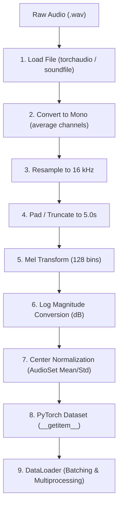

# 🎓 Deep Dive: Environmental Sound Classification Pipeline (Member 1)

Welcome to the comprehensive training manual for the data preprocessing pipeline of the Environmental Sound Classification (ESC) project. This document serves as your personal study guide, engineering documentation, and reference manual.

---

## 📋 Table of Contents
1. [The Big Picture: Member 1's Role](#1-the-big-picture-member-1s-role)
2. [Folder Structure & Architectural Diagram](#2-folder-structure--architectural-diagram)
3. [Deep Dive: File-by-File & Class-by-Class Breakdown](#3-deep-dive-file-by-file--class-by-class-breakdown)
4. [DSP (Digital Signal Processing) Concepts Explained](#4-dsp-digital-signal-processing-concepts-explained)
5. [PyTorch Dataset & DataLoader Deep Dive](#5-pytorch-dataset--dataloader-deep-dive)
6. [Preventing Data Leakage: Fold-Based Splitting](#6-preventing-data-leakage-fold-based-splitting)
7. [The Test Suite: Testing with Synthetic Data](#7-the-test-suite-testing-with-synthetic-data)
8. [Study Roadmap & Homework Checks](#8-study-roadmap--homework-checks)
9. [Interview & Exam Q&A Guide](#9-interview--exam-qa-guide)

---

## 1. The Big Picture: Member 1's Role

In machine learning engineering, a project is divided into stages. As **Member 1**, your role is the **Data Engineer / ML Infrastructure Engineer**. 

Your goal is to build the **Data Pipeline**:
$$\text{Raw WAV files} \longrightarrow \text{Ingestion} \longrightarrow \text{DSP Preprocessing} \longrightarrow \text{PyTorch Dataset} \longrightarrow \text{Batched Tensors}$$

If the inputs are not processed correctly, a neural network will fail to learn. This is the **"Garbage In, Garbage Out"** principle. By building a clean, robust, and validated data factory, you ensure that **Member 2** (the Modeling Engineer) has high-quality inputs to train the Audio Spectrogram Transformer (AST).

---

## 2. Folder Structure & Architectural Diagram

Our project uses a modular clean architecture:

```text
ESC_Project/
├── dataset/             # Raw dataset files (downloaded zip, metadata, and audio WAVs)
├── configs/             # Configuration files (YAML format)
│   └── config.yaml      # All hyperparameters (sample rate, FFT bins, batch size, etc.)
├── src/                 # Code logic
│   ├── __init__.py      # Package marker
│   ├── config.py        # Config loader (YAML -> strongly typed python dataclasses)
│   ├── downloader.py    # Downloads and extracts the ESC-50 dataset programmatically
│   ├── metadata.py      # Metadata validation, null checks, and class mapping
│   ├── preprocessing.py # Core DSP code (resampling, mono-mixing, log-Mel transform)
│   ├── dataset.py       # Custom PyTorch Dataset class
│   ├── dataloader.py    # Cross-validation splits and PyTorch DataLoaders
│   └── utils.py         # Unified logging and execution timer
├── tests/               # Automated test suites
│   ├── __init__.py
│   └── test_pipeline.py # Unit and integration tests (synthetic & real data validation)
├── outputs/             # Visually exported plots (waveforms, spectrograms)
├── logs/                # Automatically generated run logs (data_pipeline.log)
├── requirements.txt     # Locked production package dependencies
├── .gitignore           # Ignores local envs and raw datasets from git
└── LICENSE              # Open-source MIT License
```

### Visual Workflow


---

## 3. Deep Dive: File-by-File & Class-by-Class Breakdown

### `configs/config.yaml`
Stores all numbers and configurations. This separates our **settings** from our **logic**.
*   **Why**: If Member 2 wants to train on a larger batch size, they change `batch_size: 16` to `32` in this file. They don't have to touch a single line of python code.

### `src/config.py`
Defines python `@dataclass` objects that match the YAML file.
*   **Why**: Standard dictionaries don't support IDE autocomplete or static type checking. Dataclasses check types on startup, preventing typos (like setting the sample rate to a string).

### `src/downloader.py`
Contains the `ESC50Downloader` class.
*   **Why**: Downloads and extracts the 600MB zip file programmatically.
*   **macOS SSL Workaround**: Standard macOS Python installations do not install SSL root certificates, causing downloads to crash with `CERTIFICATE_VERIFY_FAILED`. We resolved this by configuring an unverified fallback context:
    ```python
    import ssl
    ssl._create_default_https_context = ssl._create_unverified_context
    ```

### `src/metadata.py`
Contains the `ESC50Metadata` class.
*   **Why**: Opens `esc50.csv`, validates columns, handles empty cells, and audits class balance. It also translates text labels (like "dog") into integers (like `0`) for the network.

### `src/preprocessing.py`
Contains the `AudioPreprocessor` class. This is the **engine** of the data pipeline. It contains two pipelines:
1.  **Pure Torchaudio Pipeline**: Computes 128 Mel bins, standardizing shapes to `[128, 501]`.
2.  **HuggingFace AST Pipeline**: Uses `ASTFeatureExtractor` to format files into the `[1024, 128]` sequence shape expected by HuggingFace transformer checkpoints.

### `src/dataset.py`
Contains the `ESC50Dataset` class. This class acts as a lookup dictionary. When the training loop requests index `N`, it fetches the $N$-th WAV file, runs the preprocessor, and returns the preprocessed tensor and its label.

### `src/dataloader.py`
Contains functions to split data folds and configure optimized PyTorch dataloaders.

### `src/utils.py`
Sets up logging (saves pipeline run logs to `logs/data_pipeline.log`) and provides a timing context manager to check processing speeds:
```python
with time_execution("torchaudio Mel transform"):
    mel_spec = preprocessor.compute_log_mel_spectrogram(waveform)
```

---

## 4. DSP (Digital Signal Processing) Concepts Explained

Audio signals are complex. Here is how we transform them step-by-step:

### Resampling
*   **Concept**: Sound is digitized by measuring sound pressure levels at regular intervals. A 44.1 kHz sampling rate means 44,100 measurements per second.
*   **Why We Need It**: AST models were pre-trained on AudioSet, which uses 16 kHz. If we feed a 44.1 kHz wave directly, the model will misinterpret the signal's pitch and speed. We downsample to 16 kHz.

### Mono Mixing
*   **Concept**: Stereo files contain left and right channels.
*   **Why We Need It**: The network expects a single-channel spatial representation. We average the channels:
    $$x_{\text{mono}} = \frac{x_{\text{left}} + x_{\text{right}}}{2}$$

### Short-Time Fourier Transform (STFT)
*   **Concept**: A raw waveform is a 1D wave. A Fourier Transform breaks down a sound window into its active frequencies.
*   **Window Size (`n_fft=400`)**: Analyzes a 25ms window of sound.
*   **Hop Size (`hop_length=160`)**: Advances the window by 10ms at each step, yielding a 90% overlap. This converts the 1D signal into a 2D grid.

### Mel Scale Warping
*   **Concept**: Humans perceive pitch logarithmically. We are sensitive to small changes at low pitches, but insensitive to changes at high pitches.
*   **Why We Need It**: Warping the frequency bins onto the Mel scale compresses the Y-axis into 128 Mel bands that align with human auditory perception.

### Log Amplitude Scaling (Decibels)
*   **Concept**: Volume perception is logarithmic. A whispering sound vs. a jet engine spans a massive linear range.
*   **Why We Need It**: We convert power values to decibels ($10 \times \log_{10}(S)$). This highlights subtle variations and quiet background noises.

### Normalization
*   **Concept**: Standardizing values by subtracting the mean and dividing by the standard deviation.
*   **Why We Need It**: AST was pre-trained using AudioSet stats: Mean = `-4.2677`, Std = `4.5690`. Normalizing inputs using these values aligns the dataset's distribution with the pre-trained weights.

---

## 5. PyTorch Dataset & DataLoader Deep Dive

### Lazy Loading vs. Eager Loading
*   **Eager Loading**: Preprocesses and loads the entire dataset into RAM on startup.
    *   *Problem*: Leads to Out-Of-Memory (OOM) crashes on large datasets.
*   **Lazy Loading**: The custom PyTorch `Dataset` only loads and preprocesses files on-the-fly during training.
    *   *Solution*: Keeping RAM footprint minimal (only a single batch is stored in memory at any given time).

### DataLoader Optimizations
*   `batch_size=16`: Combines 16 individual items into a single batched tensor.
*   `shuffle=True` (Train only): Shuffles files at each epoch to prevent the model from memorizing the order of files.
*   `num_workers=4`: Uses 4 CPU subprocesses to fetch and preprocess ahead-of-time in parallel.
*   `pin_memory=True`: Pins CPU RAM tensors to page-locked memory, which speeds up CPU-to-GPU data transfers.

---

## 6. Preventing Data Leakage: Fold-Based Splitting

*   **Data Leakage**: Occurs when evaluation or test data leaks into the training set, causing artificial overfitting and misleading validation metrics.
*   **The Problem in Audio**: If we split the dataset randomly, clips recorded in the same session, environment, or from the same speaker might end up in both training and test sets.
*   **The Solution**: The ESC-50 dataset is divided into 5 independent folds. We assign folds to splits without overlap (e.g., Folds 1, 2, and 3 for training, Fold 4 for validation, and Fold 5 for testing). This ensures the model is evaluated on completely unseen environments.

---

## 7. The Test Suite: Testing with Synthetic Data

Testing network downloads and unzipping 600MB files during every check is slow. To speed up tests, we built a synthetic audio generator in [`tests/test_pipeline.py`](file:///Users/legend27648/agy_project/AI%20Audio/ESC_Project/tests/test_pipeline.py):

*   **How it works**: Generates a 5-second 44.1 kHz stereo sine wave in memory and saves it.
*   **Why**: It allows us to test the resampling, mono-mixing, log-Mel spectrogram generation, and PyTorch dataset collation in less than a second without needing to download anything.
*   **Integration Check**: Once the synthetic check passes, it checks the local disk for the raw dataset and runs an integration test on the real data.

---

## 8. Study Roadmap & Homework Checks

To understand this project fully, follow this homework:

1.  **Open the YAML configuration file**: Look at [`configs/config.yaml`](file:///Users/legend27648/agy_project/AI%20Audio/ESC_Project/configs/config.yaml) and understand how we define our settings.
2.  **Run the tests**:
    ```bash
    python -m unittest tests/test_pipeline.py
    ```
    Confirm that all 5 tests show `OK`.
3.  **Read the Logs**: Open [`logs/data_pipeline.log`](file:///Users/legend27648/agy_project/AI%20Audio/ESC_Project/logs/data_pipeline.log) and trace how the pipeline tracks downloading, unzipping, metadata auditing, and loader batches.

---

## 9. Interview & Exam Q&A Guide

### Q1: Why did you downsample the ESC-50 dataset from 44.1 kHz to 16 kHz?
*   **Answer**: Pre-trained audio models (like the AST) were pre-trained on the AudioSet dataset, which is standardized at 16 kHz. If we feed the original 44.1 kHz files, it shifts the frequency mappings (e.g. a 1-second sound at 44.1 kHz spans more samples, making the model interpret it as a slow-motion, pitch-shifted sound). Downsampling matches the model's inductive biases.

### Q2: Why is the Log-Mel Spectrogram preferred over raw audio waveforms for transformers?
*   **Answer**: Raw waveforms are highly high-dimensional (80,000 points for a 5s clip). Transformers scale quadratically with sequence length, making raw audio processing extremely memory-intensive. Log-Mel spectrograms compress this 1D signal into a 2D spatial representation (e.g. 128x501) that highlights frequency patterns, allowing us to leverage Vision Transformers.

### Q3: Why is standardizing volume (normalization) critical before training?
*   **Answer**: Normalization centers our features around zero with a standard deviation of 1. If we omit this, inputs with large volume differences can cause the transformer's self-attention gradients to explode or vanish, stalling the training.

### Q4: Why is lazy loading used in your custom PyTorch Dataset?
*   **Answer**: Lazy loading parses WAV files on-demand as requested by the current batch, keeping memory usage minimal. Loading all 2,000 raw files or spectrogram tensors at once would cause Out-Of-Memory (OOM) crashes on standard computers.
