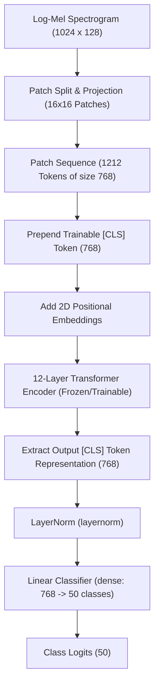
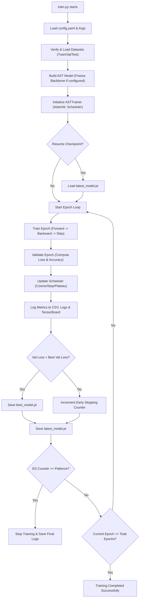

# 🎓 Environmental Sound Classification (ESC) — Member 2: Modeling & Training Guide

This document serves as the official study guide, engineering documentation, and handover manual for Member 2's implementation of the **Audio Spectrogram Transformer (AST)** training pipeline for the ESC-50 dataset.

---

## 📋 Table of Contents
1. [The Big Picture: Member 2's Role](#1-the-big-picture-member-2s-role)
2. [Folder structure](#2-folder-structure)
3. [Architecture & Training Workflow Diagrams](#3-architecture--training-workflow-diagrams)
4. [Deep Dive: How the Audio Spectrogram Transformer (AST) Works](#4-deep-dive-how-the-audio-spectrogram-transformer-ast-works)
5. [Freezing vs. Fine-Tuning (Linear Probing vs. End-to-End)](#5-freezing-vs-fine-tuning-linear-probing-vs-end-to-end)
6. [Mathematical Explanations of training Components](#6-mathematical-explanations-of-training-components)
7. [The Checkpoint & Resume Architecture](#7-the-checkpoint--resume-architecture)
8. [Installation & Training Guide](#8-installation--training-guide)
9. [Troubleshooting Guide](#9-troubleshooting-guide)
10. [Handover to Member 3 (Deployment & Evaluation)](#10-handover-to-member-3-deployment--evaluation)
11. [Your Study Guide & Interview Questions](#11-your-study-guide--interview-questions)

---

## 1. The Big Picture: Member 2's Role

If Member 1 is the **Data Engineer** (preparing raw logs and formatting datasets), then **Member 2** is the **Machine Learning Engineer & MLOps Architect**. 

Your job is to build the **Training Infrastructure**:
$$\text{DataLoaders} \longrightarrow \text{AST Backbone} \longrightarrow \text{Classification Head} \longrightarrow \text{Optimizer \& Loss} \longrightarrow \text{Metrics \& Checkpoints}$$

You are responsible for writing modular, production-grade PyTorch code to load the pre-trained AST model, customize it for the 50-class ESC-50 task, train it using state-of-the-art optimizers (AdamW) and schedulers, save robust checkpoints, and log everything to TensorBoard for evaluation.

---

## 2. Folder Structure

Member 2 has added the following files (indicated with `*`) to complete the training architecture:

```text
ESC_Project/
├── configs/
│   └── config.yaml      # Unified hyperparameters (Added model and training blocks*)
├── src/
│   ├── config.py        # Updated to parse ModelConfig and TrainingConfig*
│   ├── model.py         # Loads pre-trained AST and configures linear probing*
│   ├── trainer.py       # core ASTTrainer class (train/val loop, early stopping, checkpointing)*
│   ├── train.py         # CLI entrypoint to start/resume training*
│   └── ...              # Member 1 files (downloader, metadata, preprocessing, dataset, dataloader)
├── tests/
│   └── test_model.py    # Unit tests (verifies loading, training, validation, checkpoints)*
└── requirements.txt     # Updated to include tensorboard*
```

---

## 3. Architecture & Training Workflow Diagrams

### Model Architecture
The Audio Spectrogram Transformer processes 2D Log-Mel spectrogram inputs by splitting them into patches, projecting them to 1D, and routing them through a Transformer Encoder:



### Training Loop State Machine
The training script orchestrates epochs, validation runs, checkpoint saving, and early stopping checks:



---

## 4. Deep Dive: How the Audio Spectrogram Transformer (AST) Works

### 1. What is the AST?
The Audio Spectrogram Transformer (AST) is an attention-based neural network architecture. It was developed to apply the self-attention mechanisms of the **Vision Transformer (ViT)** directly to audio spectrograms. Unlike traditional Convolutional Neural Networks (CNNs), which process audio using local spatial filters, the AST captures long-range temporal and frequency dependencies from the very first layer.

### 2. How Spectrograms Enter the Model
An audio signal is a 1D sequence of amplitude measurements. It is transformed into a 2D Log-Mel spectrogram, which plots frequency on the Y-axis and time on the X-axis. 
The AST treats this spectrogram image (dimensions $1024 \times 128$) as a grid. It splits the grid into overlapping $16 \times 16$ patches.
- The number of patches along the time axis is: $\frac{1024 - 16}{10} + 1 = 101$ (with a stride of 10).
- The number of patches along the frequency axis is: $\frac{128 - 16}{10} + 1 = 12$.
- This yields a sequence of $101 \times 12 = 1212$ patches.
- Each $16 \times 16$ patch is flattened into a 1D vector of size $256$ ($16 \times 16 = 256$).
- A linear projection layer projects this 256-dimensional vector to the transformer's hidden dimension size, $D = 768$.

### 3. What is the CLS Token?
Before the sequence of 1212 projected patch tokens is passed to the Transformer encoder, a special trainable token called the **`[CLS]` (Classification) Token** is prepended to the sequence. 
Since the self-attention layers allow every token to interact with every other token, the `[CLS]` token aggregates information from all frequency and time patches. After passing through the 12 encoder layers, the output vector corresponding to the `[CLS]` token is extracted and used as the aggregate representation of the audio clip. This $768$-dimensional vector is then passed directly to the classification head.

---

## 5. Freezing vs. Fine-Tuning (Linear Probing vs. End-to-End)

When adapting a pre-trained model to a new task, we have two primary training strategies:

### 1. Linear Probing (Frozen Encoder)
We freeze all parameter weights in the transformer backbone:
```python
param.requires_grad = False
```
Only the weights of the classification head are updated during training.
* **Why**: The pre-trained model has already learned to extract high-quality, generalizable audio representations from massive datasets (like AudioSet). Freezing these layers prevents the model from overfitting on a small dataset like ESC-50.
* **Advantages**: Faster training, lower memory usage, and guarantees stable convergence.
* **Disadvantages**: Limits the model's accuracy, as the feature extractor cannot adapt to the specific features of environmental sounds.

### 2. Full Fine-Tuning (Unfrozen Encoder)
All parameters in the backbone and classification head are kept trainable:
```python
param.requires_grad = True
```
* **Why**: Allows the attention layers to adapt to the specific patterns of the ESC-50 classes.
* **Advantages**: Achieves significantly higher classification accuracy.
* **Disadvantages**: Prone to overfitting on small datasets, requires longer training times, and requires careful learning rate tuning to prevent catastrophic forgetting.

---

## 6. Mathematical Explanations of Training Components

### 1. Loss Function: Cross-Entropy Loss
For a classification task with $C$ classes, the model outputs raw unnormalized values called logits: $\mathbf{z} = [z_1, z_2, \dots, z_C]$. 
First, we apply the **Softmax** function to convert the logits into a probability distribution:
$$P(y = i \mid \mathbf{z}) = \frac{e^{z_i}}{\sum_{j=1}^C e^{z_j}}$$
The **Cross-Entropy Loss** measures the discrepancy between these predicted probabilities and the true target labels (which are one-hot encoded vectors where the true class index has value 1, and all other indexes have value 0):
$$\mathcal{L} = -\sum_{i=1}^C y_i \log(P(y = i \mid \mathbf{z})) = -\log(P(y = c \mid \mathbf{z}))$$
Where $c$ is the true class index. Minmizing this loss maximizes the log-likelihood of the correct class.

### 2. Optimizer: AdamW
AdamW is an extension of the **Adam (Adaptive Moment Estimation)** optimizer. 
Standard Adam tracks the moving averages of the gradients (first moment $m_t$) and the squared gradients (second moment $v_t$):
$$m_t = \beta_1 m_{t-1} + (1 - \beta_1) g_t$$
$$v_t = \beta_2 v_{t-1} + (1 - \beta_2) g_t^2$$
$$\theta_t = \theta_{t-1} - \frac{\eta}{\sqrt{\hat{v}_t} + \epsilon} \hat{m}_t$$
In standard L2 regularization (weight decay), a penalty term is added directly to the loss function. In Adam, this penalty gets scaled by the historical gradient variance $\hat{v}_t$, which decreases weight decay for parameters with frequent updates. 
**AdamW decouples weight decay** from the gradient update step, applying weight decay directly to the weights:
$$\theta_t = (1 - \eta \lambda) \theta_{t-1} - \frac{\eta}{\sqrt{\hat{v}_t} + \epsilon} \hat{m}_t$$
Where $\lambda$ is the weight decay hyperparameter. This decoupling improves generalization and is critical for training Transformer architectures.

### 3. Learning Rate Schedulers
A learning rate scheduler adjusts the learning rate ($\eta$) during training to improve convergence:
- **Cosine Annealing (`CosineAnnealingLR`)**: Gradually decays the learning rate following a cosine curve:
  $$\eta_t = \eta_{\text{min}} + \frac{1}{2}(\eta_{\text{max}} - \eta_{\text{min}})\left(1 + \cos\left(\frac{T_{\text{cur}}}{T_{\text{max}}}\pi\right)\right)$$
  This allows large initial steps to escape local minima, and small steps at the end for fine-tuning.
- **Reduce Lr on Plateau (`ReduceLROnPlateau`)**: Monitors validation loss and multiplies the learning rate by a decay factor (e.g., $0.1$) if the loss fails to improve for a set number of epochs.
- **Step Decay (`StepLR`)**: Multiplies the learning rate by a decay factor at fixed epoch intervals.

---

## 7. The Checkpoint & Resume Architecture

In deep learning engineering, training runs can take hours or days and are susceptible to hardware interruptions (e.g., spot instance preemption, power loss). 

To address this, our checkpoint architecture saves the complete execution state to disk:
1. **Model Weights (`model_state_dict`)**: The learned weights of the neural network layers.
2. **Optimizer State (`optimizer_state_dict`)**: The historical gradient momentum and variance matrices tracked by AdamW. Without this, resuming training would reset the adaptive learning rates, destabilizing convergence.
3. **Scheduler State (`scheduler_state_dict`)**: The current step count and learning rate decay phase.
4. **Validation Metrics & Epoch**: Tracks the progress to resume from the exact epoch.

### File Outputs
- `best_model.pt`: Saved only when validation loss improves. Used for deployment and evaluation.
- `latest_model.pt`: Overwritten at the end of every epoch. Used to resume training if interrupted.

---

## 8. Installation & Training Guide

### 1. Installation
Activate your virtual environment and install the requirements (which now include tensorboard):
```bash
pip install -r requirements.txt
```

### 2. Starting a New Training Run
To start a new training run using the default configs:
```bash
python src/train.py
```
This script will automatically:
1. Verify/download the ESC-50 dataset.
2. Log-Mel preprocess the training, validation, and test splits.
3. Build and initialize the AST model.
4. Run the training epochs.
5. Save logs to `outputs/logs/` and TensorBoard metrics to `outputs/tensorboard/`.

### 3. Overriding Hyperparameters via CLI
You can override configurations directly from the terminal without editing files:
```bash
# Run full fine-tuning (backbone unfrozen) for 15 epochs with a smaller learning rate:
python src/train.py --freeze false --epochs 15 --lr 5e-5
```

### 4. Resuming Training
To resume training from where you left off after an interruption:
```bash
python src/train.py --resume outputs/checkpoints/latest_model.pt
```

### 5. Launching TensorBoard
To visualize training curves in real-time, run:
```bash
tensorboard --logdir outputs/tensorboard
```
Open the printed URL (usually `http://localhost:6006`) in your browser.

---

## 9. Troubleshooting Guide

| Issue | Root Cause | Solution |
|---|---|---|
| `CUDA Out of Memory (OOM)` | Batch size is too large for GPU VRAM. | Set `batch_size` to `8` or `4` in `configs/config.yaml`, or run training in linear probing mode. |
| `ModuleNotFoundError: No module named 'tensorboard'` | TensorBoard library is missing from the environment. | Run `pip install tensorboard` or update your packages. |
| `HuggingFace Hub connection timeout` | Network restrictions or firewalls block connection to `huggingface.co`. | Set the environment variable `export HF_HUB_OFFLINE=1` if weights are already cached, or configure a proxy. |
| `SSL: CERTIFICATE_VERIFY_FAILED` | Python installation on macOS lacks SSL certificates. | Run the script `/Applications/Python\ 3.x/Install\ Certificates.command` on your Mac. |

---

## 10. Handover to Member 3 (Deployment & Evaluation)

Welcome **Member 3** (the Deployment, Evaluation, and Inference Engineer) to the codebase! Here is everything you need to know to take our work to production.

### 1. Key Outputs Produced by Member 2
- **`outputs/checkpoints/best_model.pt`**: This is the file you must load. It contains the optimized weights of the model that achieved the lowest validation loss during training.
- **`outputs/logs/training_history.csv`**: Contains the epoch-by-epoch loss and accuracy metrics. Useful if you want to plot training curves for the final report.

### 2. How to Load the Best Model for Inference
Use the following Python snippet to load the saved checkpoint:

```python
import torch
from src.config import PipelineConfig
from src.model import build_ast_model

# 1. Load configuration
config = PipelineConfig.from_yaml("configs/config.yaml")

# 2. Build the model architecture (matches training configuration)
model = build_ast_model(config)

# 3. Load checkpoint weights
checkpoint_path = "outputs/checkpoints/best_model.pt"
checkpoint = torch.load(checkpoint_path, map_location="cpu")
model.load_state_dict(checkpoint["model_state_dict"])

# 4. Set to evaluation mode
model.eval()
print("Best AST model successfully loaded and ready for evaluation!")
```

### 3. What You Should NOT Modify
- **Do not modify the preprocessing parameters in `configs/config.yaml`** (`target_sr`, `n_mels`, `n_fft`, `hop_length`, `mean`, `std`). If these are altered, the inputs passed during inference will not match the model's training distribution, degrading classification performance.

---

## 11. Your Study Guide & Interview Questions

To ace your machine learning interviews and project presentations, you must master the following concepts:

### Key Files to Study First
1. **`src/model.py`**: Study how `ignore_mismatched_sizes=True` replaces the classification head and how we freeze parameters.
2. **`src/trainer.py`**: Understand the optimizer instantiation, validation steps, and the math behind early stopping.
3. **`tests/test_model.py`**: See how we dry-run training using synthetic tensors.

### Interview Q&A

#### Q1: What is the purpose of the CLS token in AST?
* **Answer**: The CLS (Classification) token is a dummy token prepended to the patch sequence before passing it to the Transformer. Because self-attention allows all tokens to exchange information, the output state of the CLS token aggregates global acoustic context from all patches. We extract this representation to make class predictions.

#### Q2: Why is AdamW used instead of standard SGD or Adam?
* **Answer**: SGD scales all parameter updates uniformly. Adam introduces adaptive learning rates for each parameter based on historical gradients. However, standard Adam direct weight decay acts as L2 regularization, which distorts weight updates for moving averages. AdamW decouples weight decay, applying the weight penalty directly to parameter values, which significantly improves training stability and generalization for transformers.

#### Q3: Why do we freeze the encoder backbone during Linear Probing?
* **Answer**: Linear probing freezes the feature extractor and only updates the classifier head. This reduces the number of trainable parameters (from 86 million down to 39 thousand), preventing overfitting on small datasets and speeding up training.

#### Q4: How does early stopping work?
* **Answer**: Early stopping monitors validation loss at the end of each epoch. If the validation loss fails to decrease for a set number of consecutive epochs (the patience parameter), training is stopped to prevent the model from overfitting on the training set.
