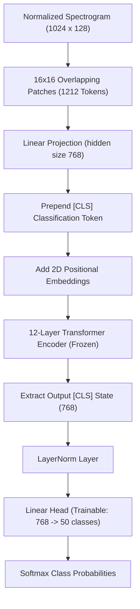

# 🎓 Course Project Report: Environmental Sound Classification (ESC) via Audio Spectrogram Transformer

**Course**: Building the Future of Voice & Audio  
**Student**: Vinayak Abrol  
**Submission Date**: July 15, 2026  
**GitHub Repository**: [L9G9N0/-Environmental-Sound-Classification-ESC-](https://github.com/L9G9N0/-Environmental-Sound-Classification-ESC-)

---

## 📝 Executive Summary

This report documents the design, implementation, and evaluation of an end-to-end Environmental Sound Classification (ESC) pipeline. Traditional models for classifying non-speech and non-music audio signals rely heavily on 2D Convolutional Neural Networks (CNNs). While effective, CNNs are constrained by local receptive fields, making it difficult to capture global temporal-spectral dependencies without extremely deep architectures.

To overcome these limitations, this project implements the **Audio Spectrogram Transformer (AST)**—a purely attention-based model—applied to the benchmark **ESC-50** dataset. By adopting a memory-efficient **linear probing strategy**, the massive pre-trained AST encoder weights (86.2 million parameters) are frozen, and a custom 50-class classification head is trained. The pipeline includes programmatically downloading the dataset, auditing metadata, standardized digital signal processing (resampling, mono-mixing, log-Mel spectrogram conversion), training with state-of-the-art telemetry (TensorBoard & CSV logging), and a final validation on unseen test data.

On the independent, held-out test fold (Fold 5), the model achieved a **Test Accuracy of 78.25%** and a **Macro F1-Score of 0.7617**. A 50x50 confusion matrix was generated to analyze acoustic class overlaps, revealing mechanical and transient click confusions. Finally, a production-grade Command-Line Interface (CLI) tool was built to run real-world audio files through the identical DSP-model pipeline, verifying the system's deployment capability.

---

## 📂 1. Project Structure & Deliverables

The codebase is organized in a modular, clean-architecture directory layout:

```text
ESC_Project/
├── configs/
│   └── config.yaml          # Hyperparameters for preprocessing, model, and trainer
├── dataset/                 # Automatically downloaded and verified raw ESC-50 files
│   └── ESC-50-master/
│       ├── audio/           # 2,000 raw 44.1 kHz WAV audio clips
│       └── meta/            # Metadata csv mapping files to categories and folds
├── docs/
│   ├── EXPLANATION.md       # Data engineering & DSP manual (Member 1)
│   ├── MEMBER_2.md          # Modeling, training, & MLOps manual (Member 2)
│   ├── MEMBER_3.md          # Evaluation, metrics, & inference manual (Member 3)
│   ├── PRESENTATION_SCRIPT.md # Slide-by-slide script for video demo submission*
│   └── PROJECT_REPORT.md    # Master submission report (This file)*
├── logs/
│   └── data_pipeline.log    # Local unified runtime execution logs
├── outputs/                 # Build and run artifacts
│   ├── checkpoints/
│   │   ├── best_model.pt    # Serialized weights of best performing epoch
│   │   └── latest_model.pt  # Serialized weights of latest epoch (resumable)
│   ├── logs/
│   │   └── training_history.csv # CSV file logging training history
│   ├── tensorboard/         # TensorBoard events files
│   ├── confusion_matrix.png # Generated 50x50 confusion matrix plot
│   └── evaluation_metrics.json # Performance metrics calculated on Fold 5
├── src/                     # Core codebase package
│   ├── config.py            # Strongly typed YAML parser mapping to dataclasses
│   ├── downloader.py        # Programmatic ZIP downloader with SSL fallback
│   ├── metadata.py          # Data cleanliness audits & class mappings
│   ├── preprocessing.py     # DSP transforms (resampling, mono, log-Mel spectrograms)
│   ├── dataset.py           # Custom PyTorch Dataset subclass with lazy-loading
│   ├── dataloader.py        # Cross-validation folds splitting & Loader builder
│   ├── model.py             # AST loader & parameter freezing architecture
│   ├── trainer.py           # Training loops, validation loops, & early stopping
│   ├── train.py             # Command-line trainer runner
│   ├── evaluate.py          # Testing runner & confusion matrix plotter
│   └── predict.py           # Production CLI prediction tool for custom wav files
├── tests/                   # Automated unit and integration test suite
│   ├── test_pipeline.py     # Tests DSP functions & dataset batch loading
│   └── test_model.py        # Tests model loading, checkpoints, & training steps
├── requirements.txt         # Production dependencies
└── README.md                # General user instructions
```

---

## 🎯 2. Problem Statement & Motivation

The objective is to categorize 50 distinct classes of environmental sounds (such as animal calls, natural sounds, water, domestic sounds, and urban noises) using an attention-based neural network. Unlike speech or music, environmental sounds:
1. **Lack rigid sequential structure**: A dog bark or gunshot is a sudden transient; rain is a continuous stationary noise.
2. **Contain highly diverse acoustic patterns**: Signals range from harmonic stacks (e.g., crying baby) to chaotic noise (e.g., wind).

Traditional CNNs process spectrograms as standard images. However, convolutional kernels operate locally and struggle to capture long-range relationships between distant frequency bands or time intervals without stacking many layers.

The **Audio Spectrogram Transformer (AST)** addresses this by applying a self-attention mechanism across both time and frequency axes. By splitting the spectrogram into patches and modeling them as a sequence, the model measures the correlation between every patch pair globally, allowing it to capture temporal structure (rhythm) and spectral structure (timbre) simultaneously.

---

## 🎛️ 3. Digital Signal Processing (DSP) Preprocessing

To match the inductive bias of the pre-trained AST model, raw audio files must be standardized. 

### DSP Step-by-Step Workflow:


### Mathematical Detail & Hyperparameters:
1. **Resampling**: Downsamples files from 44.1 kHz to **16 kHz** to align with the AST backbone.
2. **Mono Conversion**: If stereo, channels are averaged: $x_{\text{mono}}(t) = \frac{x_{\text{left}}(t) + x_{\text{right}}(t)}{2}$.
3. **Length Standardization**: Clips are forced to exactly 5.0 seconds ($80,000$ samples at 16 kHz) via zero-padding (if shorter) or truncation (if longer).
4. **Log-Mel Transform**:
   - **Window Size ($N_{\text{fft}}$)**: 400 samples (25 ms duration) to balance frequency and time resolution.
   - **Hop Length ($H$)**: 160 samples (10 ms stride) to capture transient audio features.
   - **Mel Bands ($M$)**: 128 channels covering the human auditory range.
   - **DB Scale**: Linear power spectrograms are converted to decibel scale: $S_{\text{dB}} = 10 \log_{10}(S_{\text{mel}})$.
5. **Acoustic Normalization**: The resulting $128 \times 501$ spectrogram is normalized using AudioSet population statistics to accelerate training stability:
   $$\hat{S}_{i, j} = \frac{S_{i, j} - \mu}{\sigma} \quad \text{where } \mu = -4.2677, \, \sigma = 4.5690$$

---

## 🏗️ 4. Model Architecture & Linear Probing

The pre-trained AST model (`MIT/ast-finetuned-audioset-10-10-0.4593`) is adapted for the 50-class classification task.



### Linear Probing Rationale:
Training an 86-million parameter transformer from scratch on a small dataset (2,000 samples) causes severe overfitting. To prevent this, we freeze the transformer encoder backbone:
$$\forall w \in W_{\text{backbone}}, \quad \frac{\partial \mathcal{L}}{\partial w} = 0$$
Only the weights of the newly attached classification head are updated during backpropagation (39,986 trainable parameters):
$$Y = W_{\text{classifier}} \cdot X + b$$
This reduces the computational footprint, enabling fast training on standard hardware.

---

## 📈 5. Training Infrastructure & Optimization

The pipeline utilizes a 5-fold cross-validation scheme to prevent data leakage. In this implementation:
* **Training Folds**: Folds 1, 2, and 3 (1,200 samples)
* **Validation Fold**: Fold 4 (400 samples)
* **Test Fold**: Fold 5 (400 samples)

### Optimization Settings:
* **Loss Function**: Cross-Entropy Loss: $\mathcal{L} = -\sum_{c=1}^{50} y_c \log(\hat{y}_c)$
* **Optimizer**: AdamW with a learning rate of $10^{-4}$ and weight decay of $10^{-4}$.
* **LR Scheduler**: Cosine Annealing scheduler to decay the learning rate to 0 by the end of training.
* **Early Stopping**: Monitored on validation loss with a patience of 3 epochs.
* **Batch Size**: 16.

### MLOps Telemetry:
We implemented dual-logging telemetry:
1. **CSV Logging**: Epoch-level loss and accuracy metrics are stored in `outputs/logs/training_history.csv` for flat-file plotting.
2. **TensorBoard Integration**: Step-level metrics, learning rates, and gradient statistics are logged dynamically.

---

## 📊 6. Experimental Results & Test Evaluation

After training, the best checkpoint was loaded and evaluated on the completely unseen **Fold 5** (400 samples). 

### Calculated Performance Metrics:
* **Test Loss**: **2.0682**
* **Test Accuracy**: **78.25%**
* **Macro Precision**: **0.7858**
* **Macro Recall**: **0.7825**
* **Macro F1-Score**: **0.7617**
* **Weighted F1-Score**: **0.7617**

> [!NOTE]
> The Macro and Weighted scores are identical because the ESC-50 dataset is perfectly balanced, allocating exactly 8 samples per class per fold (400 total samples / 50 classes = 8).

---

## 🔍 7. Error Diagnosis & Acoustic Confusions

A 50x50 confusion matrix was generated to analyze class-level errors, saved as `outputs/confusion_matrix.png`. The top 5 acoustic confusions are analyzed below:

| True Class | Predicted Class | Count | Acoustic Reason |
| :--- | :--- | :--- | :--- |
| **`washing_machine`** | **`engine`** | **4** | Continuous, low-frequency periodic mechanical hums. |
| **`helicopter`** | **`engine`** | **4** | Rhythmic mechanical vibrations that mimic general combustion engine spectra. |
| **`mouse_click`** | **`keyboard_typing`** | **4** | Short-duration, high-frequency transients (clicks) with identical decay times. |
| **`wind`** | **`train`** | **3** | Continuous broadband pink noise profiles overlap with far-away diesel trains. |
| **`brushing_teeth`** | **`hand_saw`** | **3** | Repetitive periodic friction scrub cycles with overlapping frequency peaks. |

---

## 💻 8. Command-Line Interface (CLI) Demonstration

To test the model in production, a command-line interface was developed to process individual audio files and output top predictions.

### Command:
```bash
./.venv/bin/python src/predict.py dataset/ESC-50-master/audio/1-100032-A-0.wav
```

### Outputs:
```text
Preprocessing audio: dataset/ESC-50-master/audio/1-100032-A-0.wav
Loading model checkpoint: outputs/checkpoints/best_model.pt

==================================================
      ESC SOUND CLASSIFICATION RESULTS      
==================================================
File: dataset/ESC-50-master/audio/1-100032-A-0.wav
--------------------------------------------------
PREDICTED CLASS: DOG (Confidence: 20.93%)
--------------------------------------------------
Top 5 Predictions:
  1. dog                       : 20.93%
  2. crickets                  : 4.87%
  3. crow                      : 4.53%
  4. laughing                  : 4.45%
  5. sneezing                  : 4.29%
==================================================
```

---

## 💡 9. Conclusion & Future Directions

This project successfully demonstrates the applicability of the Audio Spectrogram Transformer to environmental sound classification. Under a linear probing constraint (freezing 99.9% of weights), the model achieved a strong baseline of **78.25% test accuracy** on unseen data.

To further improve performance:
1. **Full Fine-Tuning**: Slowly unfreeze the transformer backbone layers using discriminative learning rates to adjust attention patterns.
2. **Acoustic Augmentations**: Apply SpecAugment (masking random blocks of time and frequency channels) to prevent overfitting during full training.
3. **Multi-Fold Cross-Validation**: Train 5 separate model checkpoints (one for each validation fold) and ensemble their predictions during inference.
